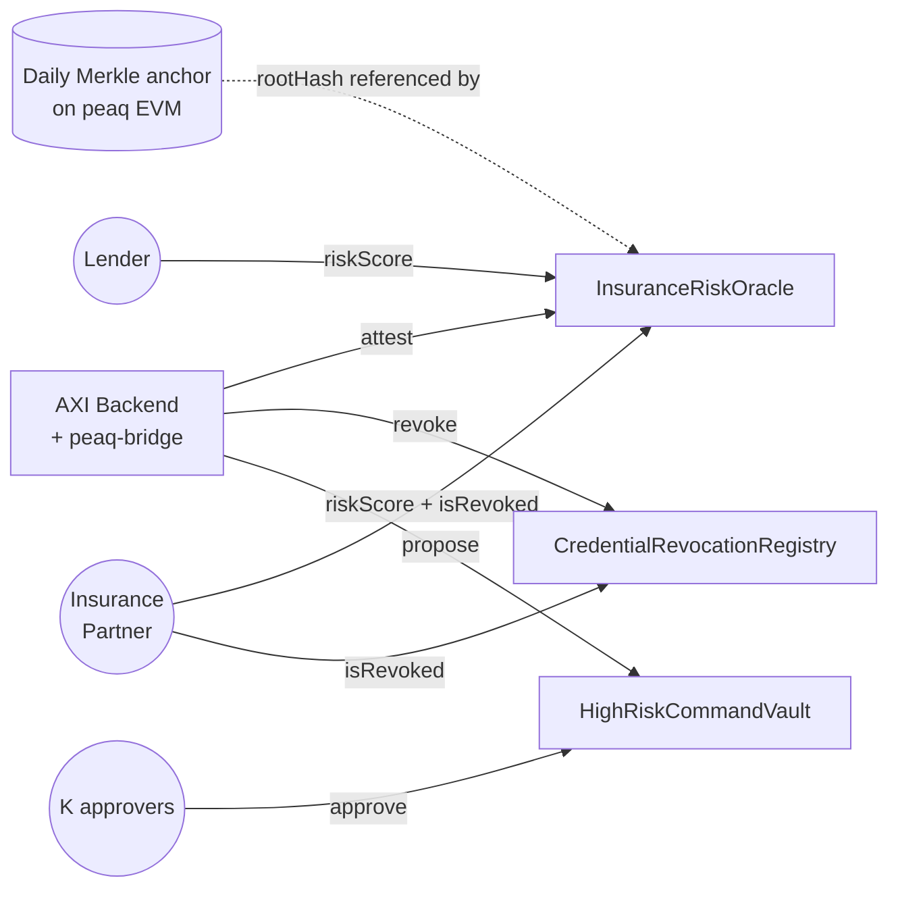
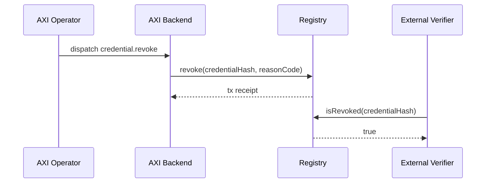
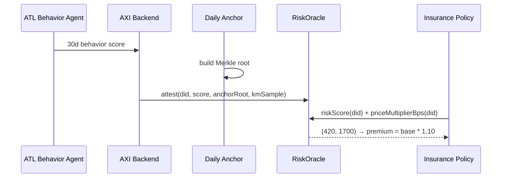
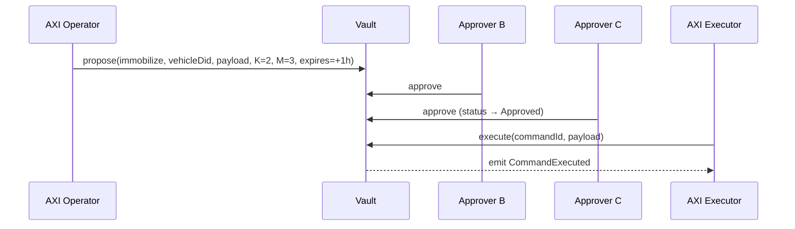

<p align="center">
  
</p>

<p align="center">
  <a href="https://github.com/aximobility/peaq-contracts/actions/workflows/ci.yml"></a>
  <a href="LICENSE"></a>
  
  
  
  
</p>

# peaq-contracts

> Three Tier-1 Solidity contracts that take AXI Mobility out of the trust loop where it shouldn't be: credential revocation, insurance risk attestation, and high-risk command approval. Deploys to peaq EVM (chainId 3338 mainnet, 9990 agung).

This repo is **on-chain logic only**. Off-chain integration (extrinsic submission, DID issuance, Merkle anchoring) lives in [`aximobility/peaq-integration`](https://github.com/aximobility/peaq-integration).

---

## What's deployed

| Contract | Addressing | Why on-chain |
|---|---|---|
| **CredentialRevocationRegistry** | UUPS proxy | Revoke driver licenses / vehicle titles / tracker assignments. Verifiers query `isRevoked(hash)` instead of trusting AXI's REST endpoint. |
| **InsuranceRiskOracle** | UUPS proxy | AXI publishes per-vehicle risk scores cited to on-chain Merkle roots. Insurers price premiums from `riskScore()` + `priceMultiplierBps()` directly. |
| **HighRiskCommandVault** | Immutable | K-of-M on-chain approval for immobilize / geofence-change / fund-move commands. Removes "trust the AXI admin" from the threat model. |

---

## Architecture



---

## Quick start

```bash
git clone https://github.com/aximobility/peaq-contracts
cd peaq-contracts
make install            # forge install OZ + forge-std
make build
make test               # 50+ unit + fuzz tests across the three contracts
make snapshot           # gas snapshot
```

Deploy to agung testnet:
```bash
cp .env.example .env    # fill in DEPLOYER_PRIVATE_KEY + ADMIN + ISSUERS + ATTESTORS + APPROVERS
make deploy-agung
```

Verify deployment:
```bash
REGISTRY_PROXY=0x... ORACLE_PROXY=0x... VAULT=0x... ADMIN=0x... \
  make verify-agung
```

---

## Contract details

### 1. CredentialRevocationRegistry

```solidity
function revoke(bytes32 credentialHash, bytes32 reasonCode) external onlyRole(ISSUER_ROLE);
function revokeBatch(bytes32[] calldata hashes, bytes32 reasonCode) external onlyRole(ISSUER_ROLE);
function unrevoke(bytes32 credentialHash) external onlyRole(DEFAULT_ADMIN_ROLE);

function isRevoked(bytes32 credentialHash) external view returns (bool);   // free for anyone
function whyRevoked(bytes32 credentialHash) external view returns (RevocationRecord memory);
```

- **Issuance lives off-chain** (peaqStorage pallet via `peaq-integration`); this registry only tracks revocations
- **Idempotent at the boundary**: re-revoke is rejected so callers can't bury earlier reasonCodes
- **Batch-friendly**: 1 tx revokes a sweep when an issuer key is rotated
- **Emergency unrevoke** restricted to admin to prevent issuer-key compromise from un-revoking
- **Pausable** for incident response

### 2. InsuranceRiskOracle

```solidity
function attest(bytes32 vehicleDid, uint16 score, bytes32 anchorRoot, uint32 sampleSizeKm)
    external onlyRole(ATTESTOR_ROLE);

function riskScore(bytes32 vehicleDid) external view returns (uint16, uint64);
function priceMultiplierBps(bytes32 vehicleDid) external view returns (uint16);
function attestationCount(bytes32 vehicleDid) external view returns (uint256);  // history depth
```

- **Score** is `0..1000`; lower = safer
- **anchorRoot** must reference a Merkle root that's already on-chain via the daily anchor → third party can re-derive
- **priceMultiplierBps** linearly interpolates between admin-set floor + ceiling (default 7000 bps → 15000 bps = 30% discount → 50% surcharge)
- **History preserved**: every `attest()` appends to `attestationAt(did, i)` for audit
- **Staleness gate**: `riskScore()` reverts if older than `maxAttestationAgeSeconds` (default 7 days)
- **Recalibrate-able** via `CALIBRATOR_ROLE` without redeploying

### 3. HighRiskCommandVault

```solidity
function propose(
    bytes32 commandType, bytes32 targetDid, bytes calldata payload,
    uint8 thresholdK, uint8 totalApprovers, uint64 expiresAt
) external returns (bytes32 commandId);

function approve(bytes32 commandId) external onlyRole(APPROVER_ROLE);
function execute(bytes32 commandId, bytes calldata payload) external onlyRole(EXECUTOR_ROLE);
function cancel(bytes32 commandId) external;     // proposer or any approver
```

- **Immutable by design**: upgradeable approval = trust-loop re-entry, defeats the contract's purpose
- **Payload-hash-bound**: `propose()` stores `keccak256(payload)`; `execute()` must present the same bytes
- **Expiry window** between 1 minute and 30 days to prevent dangling proposals
- **Permissionless execution** once `K` approvals reached (typically AXI executor cron picks up `CommandApproved` events)
- **Cancel** by proposer or any approver before execution

---

## Sequence — end-to-end

### Revocation


### Risk attestation


### High-risk command


---

## Roles + admin model

| Contract | Role | Granted to | Can |
|---|---|---|---|
| Registry | DEFAULT_ADMIN_ROLE | AXI 4-of-7 multisig | grant/revoke any role, unrevoke credentials, pause |
| Registry | ISSUER_ROLE | AXI cloud convex EOA | revoke / batch-revoke credentials |
| Registry | UPGRADER_ROLE | AXI 4-of-7 multisig | UUPS upgrade |
| Oracle | DEFAULT_ADMIN_ROLE | AXI 4-of-7 multisig | grant/revoke any role |
| Oracle | ATTESTOR_ROLE | AXI atlas-harness EOA | publish risk attestations |
| Oracle | CALIBRATOR_ROLE | AXI risk team multisig | recalibrate score curve |
| Oracle | UPGRADER_ROLE | AXI 4-of-7 multisig | UUPS upgrade |
| Vault | DEFAULT_ADMIN_ROLE | AXI 4-of-7 multisig | grant/revoke any role |
| Vault | PROPOSER_ROLE | AXI cloud convex EOA | propose commands |
| Vault | APPROVER_ROLE | K named operators with HW wallets | approve commands |
| Vault | EXECUTOR_ROLE | AXI atlas-harness EOA | execute approved commands |

**Multisig recommendation**: Safe (formerly Gnosis) on peaq EVM with 4-of-7 signers across founders + operations leads.

---

## Gas snapshot (target)

| Operation | Gas | Cost @ 1 gwei |
|---|---|---|
| Registry.revoke | ~70k | ~$0.0001 |
| Registry.revokeBatch (10 entries) | ~280k | ~$0.0004 |
| Oracle.attest | ~110k | ~$0.0002 |
| Vault.propose | ~180k | ~$0.0003 |
| Vault.approve | ~55k | ~$0.0001 |
| Vault.execute | ~50k | ~$0.0001 |

Run `make snapshot` after a change to detect gas regressions.

---

## Security

- All contracts use OpenZeppelin v5 audited primitives (AccessControl, Pausable, ReentrancyGuard, UUPS)
- All state-changing functions emit events; all reverts use custom errors
- Slither + Forge fuzz + invariant tests in CI
- **Pre-audit hardening checklist**: see `AUDIT_CHECKLIST.md` (TODO before mainnet)
- **External audit required before mainnet treasury-scale ops**: scope mirrors `aximobility/platform/AUDIT_PLAN.md`

---

## Contributing

Issues + PRs welcome on `aximobility/peaq-contracts`. All PRs must pass:
- `forge fmt --check`
- `forge build --sizes`
- `forge test -vv` (unit + fuzz)
- `forge snapshot --check` (no unexplained gas regressions)
- Slither (no high-severity findings)

---

## License

Apache-2.0 — same as `aximobility/peaq-integration` and the peaq protocol itself.
